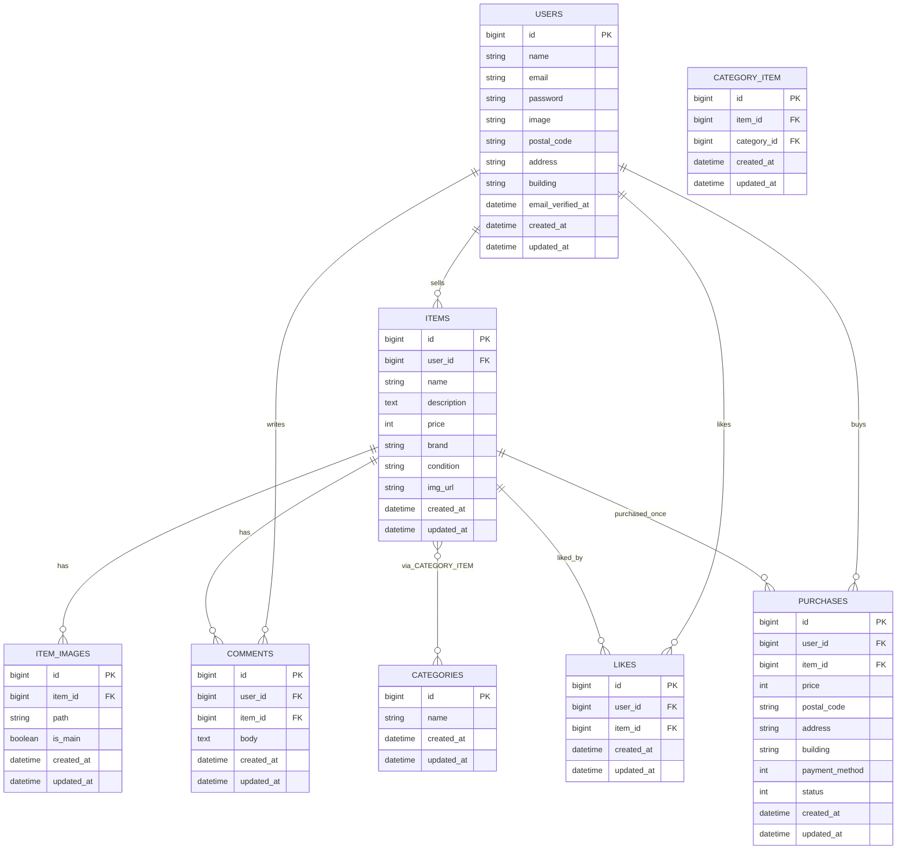

## アプリケーション名

* フリマアプリ **Mogi First**

---

## 環境構築

### 1) リポジトリを取得してディレクトリに入る

```bash
git clone git@github.com:mayu-happy/mogi-first.git
```
```bash
cd mogi-first

```

### 2) Docker ビルド & 起動

```bash
docker compose up -d --build
```

### 3) Laravel 環境構築（コンテナ内）

```bash
docker compose exec php bash
```
このプロジェクトでは、`./src` がコンテナ内の `/var/www` にマウントされます。  
コンテナに入ったら必ず **/var/www** に移動してから以下のコマンドを実行してください。

```bash
cd /var/www
```

### 4) Laravelの準備　依存インストールと.env作成

```bash
composer install
```

```bash
cp .env.example .env
```

`.env` の DB 設定をこのように変更してください（抜粋）

DB_CONNECTION=mysql
DB_HOST=mysql
DB_PORT=3306
DB_DATABASE=laravel_db
DB_USERNAME=laravel_user
DB_PASSWORD=laravel_pass


### 5) アプリキー生成
```bash
php artisan key:generate
```

### 6) マイグレーション&初期データ投入

```bash
php artisan migrate --seed
```

### 7) ストレージを公開

```bash
php artisan storage:link
```


## PHPUnit テスト実行手順

### 0) 起動（ホスト側、`docker-compose.yml` があるディレクトリで）

```bash
docker compose up -d
```
```bash
docker compose ps
```

### 1) PHPコンテナに入って初期セットアップ（初回のみ）
```bash
docker compose exec php bash
```
```bash
composer install
```
```bash
cp -n .env.example .env || true
```
```bash
php artisan key:generate
```

### 2) テスト用.env.testingを用意
```bash
cp .env .env.testing
```

`.env.testing` を開いて、テスト用のDB名にだけ変更してください。

DB_CONNECTION=mysql
DB_HOST=mysql
DB_PORT=3306
DB_DATABASE=laravel_test_db
DB_USERNAME=laravel_user
DB_PASSWORD=laravel_pass

### 3) テスト用マイグレーション（testing環境）
```bash
php artisan migrate --env=testing --no-interaction

```

### 4) テスト実行
```bash
php artisan test

```

または、詳細表示したい場合：

```bash
vendor/bin/phpunit --testdox
```

---

## 開発環境 URL

- ホーム: <http://localhost>
- 会員登録: <http://localhost/register>

---

## サンプルユーザー（ログイン用）
* テスト　花子: so.happy0713@gmail.com / password12345678
* テスト　次郎: test@example.com / password12345678


---

## フロントで使用している JavaScript

このアプリでは、UIを分かりやすくするために以下の3か所で素の JavaScript（Blade内スクリプト）を使用しています。追加のビルド手順は不要です。

1. **出品フォームの商品画像プレビュー**  
   出品画面で商品画像ファイルを選択すると、その場でプレビュー画像を表示します。

2. **プロフィール画像のプレビュー**  
   マイページのプロフィール編集画面で、アイコン画像を選び直したときに即座に表示を更新します。

3. **購入画面の支払い方法による金額表示の更新**  
   購入画面で支払い方法をプルダウンから変更したときに、小計表示をJavaScriptで切り替えます。

## ER 図


