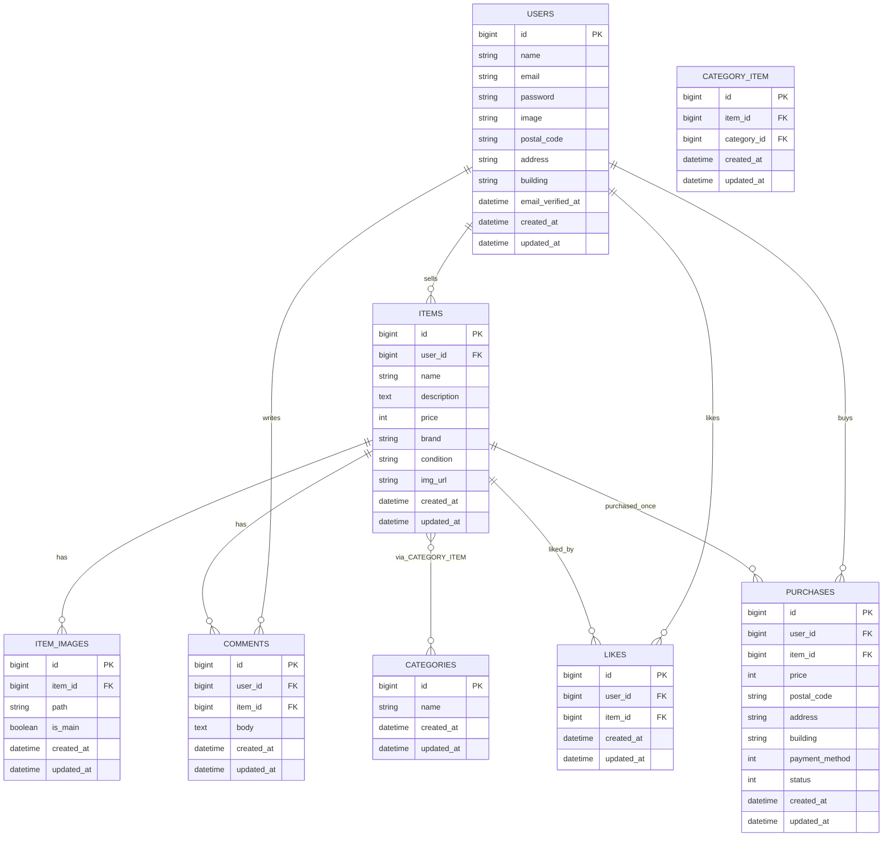

## アプリケーション名

* フリマアプリ **Mogi First**

---

## 環境構築

### 1) リポジトリを取得してディレクトリに入る

```bash
git clone git@github.com:mayu-happy/mogi-first.git
```
```bash
cd mogi-first
```
---

### 2) Docker ビルド & 起動

```bash
docker compose up -d --build
```
---

### 3) Laravel 環境構築（コンテナ内）

```bash
docker compose exec php bash
```
---

### 4) Laravelの準備　依存インストールと.env作成

```bash
composer install
```

```bash
cp .env.example .env
```

`.env` の DB 設定をこのように変更してください（抜粋）

```env
DB_CONNECTION=mysql
DB_HOST=mysql
DB_PORT=3306
DB_DATABASE=laravel_db
DB_USERNAME=laravel_user
DB_PASSWORD=laravel_pass
```
---

### 5) アプリキー生成
```bash
php artisan key:generate
```
---

### 6) マイグレーション&初期データ投入

```bash
php artisan migrate --seed
```
※カテゴリ、サンプル商品、サンプルユーザーが自動で生成されます。


## サンプルユーザー

| ユーザー名 | メールアドレス | パスワード |
|-------------|----------------|-------------|
| テスト一郎 | sample1@example.com | password |
| テスト花子 | sample2@example.com | password |


### 7) ストレージを公開

```bash
php artisan storage:link
```
---


## PHPUnit テスト実行手順

### 1) コンテナ起動（ホスト側、プロジェクトルート`mogi-first`ディレクトリで）

コンテナをバックグラウンド起動します：
```bash
docker compose up -d
```
---
コンテナが動いているか確認するには、次のコマンドを実行します：
```bash
docker compose ps
```
---

### 2) 依存導入＆アプリキー作成（初回のみ／PHPコンテナ内で実行）
```bash
docker compose exec php bash
```
ここからはphpコンテナ内 (/var/www) で実行します：
```bash
composer install
```
```bash
cp -n .env.example .env || true
```
```bash
php artisan key:generate
```
※すでに環境構築済みの場合は、このステップはスキップしてOKです。


### 3) テストDB用の.env.testing作成
```bash
cp .env .env.testing
```

`.env.testing` 内のDB設定をテスト用に変更してください（例）：

```env
DB_CONNECTION=mysql
DB_HOST=mysql
DB_PORT=3306
DB_DATABASE=laravel_test_db
DB_USERNAME=laravel_user
DB_PASSWORD=laravel_pass
```
---

### 4) テスト用マイグレーション（testing環境）
```bash
php artisan migrate --env=testing --no-interaction
```
---

### 5) テスト実行
```bash
php artisan test
```
---

または、詳細表示したい場合：

```bash
vendor/bin/phpunit --testdox
```

---

## 開発環境 URL

- ホーム: <http://localhost>
- 会員登録: <http://localhost/register>

---
## フロントで使用している JavaScript

このアプリでは、UIを分かりやすくするために以下の3か所で素の JavaScript（Blade 内スクリプト）を使用しています。  
追加のビルド手順は不要です。

1. **出品フォームの商品画像プレビュー**  
   出品画面で商品画像ファイルを選択すると、その場でプレビュー画像を表示します。

2. **プロフィール画像のプレビュー**  
   マイページのプロフィール編集画面で、アイコン画像を選び直したときに即座に表示を更新します。

3. **購入画面の支払い方法による金額表示の更新**  
   購入画面で支払い方法をプルダウンから変更したときに、小計表示を JavaScript で切り替えます。


## その他補足事項

本アプリの以下の仕様変更については、コーチより事前に許可を得ています。

1. **商品ダミーデータの追加**  
   初期表示データを増やすことで、一覧・ページネーションの動作確認を容易にするため、  
   Seeder にて商品サンプル件数を増やしています。

2. **ページネーション機能の実装**  
   商品一覧およびマイページで、可読性と操作性を考慮しページネーションを導入しています。  
   （Laravel の `paginate()` メソッドを使用）


```md
## ER 図


