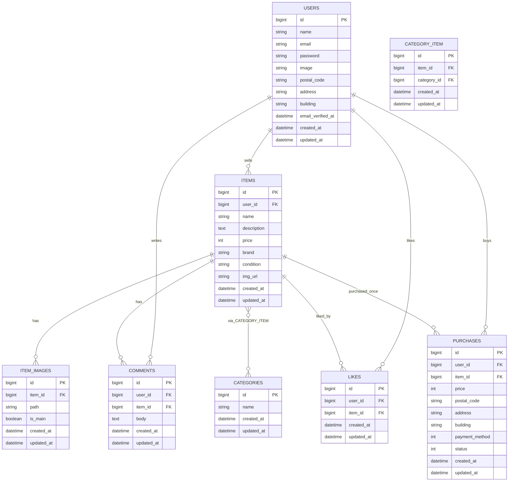

## アプリケーション名

* フリマアプリ **Mogi First**

---

## 環境構築（Docker → Laravel まで）

### 1) リポジトリ取得（SSH）

```bash
git clone git@github.com:mayu-happy/mogi-first.git mogi-first
cd mogi-first
```


### 2) Docker ビルド & 起動

```bash
docker compose up -d --build
```


### 3) Laravel 環境構築（コンテナ内）

```bash
docker compose exec php bash
```

依存導入と .env 作成：

```bash
composer install
cp .env.example .env
```

`.env` の DB 設定：

```ini
DB_CONNECTION=mysql
DB_HOST=mysql
DB_PORT=3306
DB_DATABASE=laravel_db
DB_USERNAME=laravel_user
DB_PASSWORD=laravel_pass
```

キー生成・マイグレーション・ストレージ公開：

```bash
php artisan key:generate
php artisan migrate
php artisan storage:link
```


---

## PHPUnit テスト実行

```bash
php artisan test
```

詳細表示が欲しい場合：

```bash
vendor/bin/phpunit --testdox
```

### テスト環境の .env（`.env.testing`）

####  MySQL

1. テストDBを作成（rootパスワードは docker-compose の環境変数に依存）

```bash
docker compose exec mysql bash -lc 'mysql -uroot -p"$MYSQL_ROOT_PASSWORD" -e "CREATE DATABASE IF NOT EXISTS laravel_test CHARACTER SET utf8mb4 COLLATE utf8mb4_unicode_ci;"'
```

2. `.env.testing` を作成

```ini
APP_ENV=testing
APP_KEY=base64:dummykeyfordevonly0123456789abcdef=
APP_DEBUG=true

DB_CONNECTION=mysql
DB_HOST=mysql
DB_PORT=3306
DB_DATABASE=laravel_test
DB_USERNAME=laravel_user
DB_PASSWORD=laravel_pass

CACHE_DRIVER=array
SESSION_DRIVER=array
QUEUE_CONNECTION=sync
MAIL_MAILER=log
```


---

## 開発環境 URL

* ホーム: [http://localhost](http://localhost)
* 会員登録: [http://localhost/register](http://localhost/register)
* phpMyAdmin: [http://localhost:8080](http://localhost:8080)

## サンプルユーザー投入（Seeder）

下記 Seeder を追加して適用すると、上記 2 アカウントですぐログインできます。

1) `database/seeders/TestUserSeeder.php` を作成し、次を保存：

```php
<?php

namespace Database\Seeders;

use Illuminate\Database\Seeder;
use Illuminate\Support\Facades\Hash;
use App\Models\User;

class TestUserSeeder extends Seeder
{
    public function run(): void
    {
        $users = [
            ['name' => 'テスト 花子', 'email' => 'so.happy0713@gmail.com'],
            ['name' => 'テスト 次郎', 'email' => 'test@example.com'],
        ];

        foreach ($users as $u) {
            User::updateOrCreate(
                ['email' => $u['email']],
                [
                    'name' => $u['name'],
                    'password' => Hash::make('password12345678'),
                    'email_verified_at' => now(),
                ]
            );
        }
    }
}
```

---

2) コンテナ内で実行：

```bash
docker compose exec php bash -lc "php artisan db:seed --class=TestUserSeeder"
```

> すでに同じメールのユーザーがある場合は上書き更新されます（`updateOrCreate`）。

---

## ER 図


```mermaid
erDiagram
  USERS {
    bigint id PK
    string name
    string email
    string password
    string image
    string postal_code
    string address
    string building
    datetime email_verified_at
    datetime created_at
    datetime updated_at
  }

  ITEMS {
    bigint id PK
    bigint user_id FK
    string name
    text description
    int price
    string brand
    string condition
    string img_url
    datetime created_at
    datetime updated_at
  }

  ITEM_IMAGES {
    bigint id PK
    bigint item_id FK
    string path
    boolean is_main
    datetime created_at
    datetime updated_at
  }

  CATEGORIES {
    bigint id PK
    string name
    datetime created_at
    datetime updated_at
  }

  CATEGORY_ITEM {
    bigint id PK
    bigint item_id FK
    bigint category_id FK
    datetime created_at
    datetime updated_at
  }

  COMMENTS {
    bigint id PK
    bigint user_id FK
    bigint item_id FK
    text body
    datetime created_at
    datetime updated_at
  }

  LIKES {
    bigint id PK
    bigint user_id FK
    bigint item_id FK
    datetime created_at
    datetime updated_at
  }

  PURCHASES {
    bigint id PK
    bigint user_id FK
    bigint item_id FK
    int price
    string postal_code
    string address
    string building
    int payment_method
    int status
    datetime created_at
    datetime updated_at
  }

  USERS ||--o{ ITEMS : sells
  USERS ||--o{ COMMENTS : writes
  USERS ||--o{ LIKES : likes
  USERS ||--o{ PURCHASES : buys

  ITEMS ||--o{ ITEM_IMAGES : has
  ITEMS ||--o{ COMMENTS : has
  ITEMS ||--o{ LIKES : liked_by
  ITEMS ||--o{ PURCHASES : purchased_once
  ITEMS }o--o{ CATEGORIES : via_CATEGORY_ITEM
```
