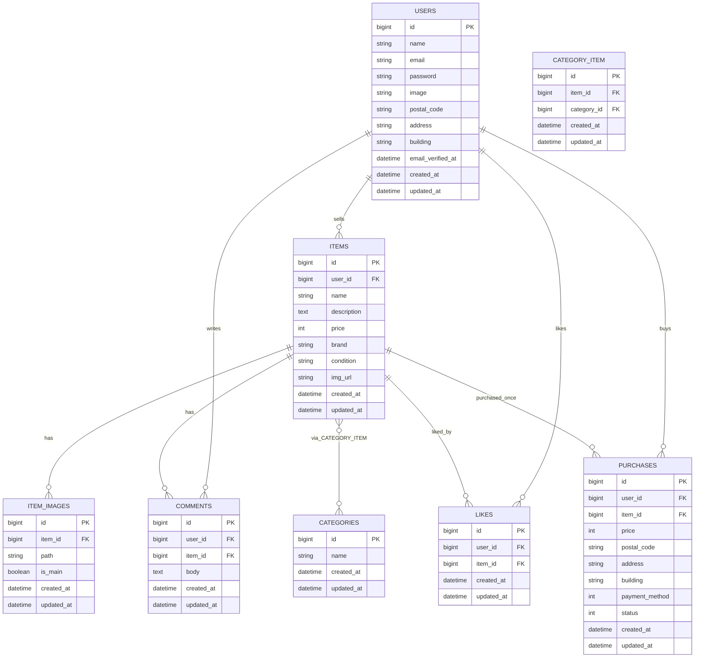

## アプリケーション名

* フリマアプリ **Mogi First**

---

## 環境構築（Docker → Laravel まで）

### 1) リポジトリ取得（SSH）

```bash
git clone git@github.com:mayu-happy/mogi-first.git mogi-first
cd mogi-first
```

### 2) Docker ビルド & 起動

```bash
docker compose up -d --build
```

### 3) Laravel 環境構築（コンテナ内）

```bash
docker compose exec php bash
```

依存導入と .env 作成：

```bash
composer install
cp .env.example .env
```

`.env` の DB 設定：
*.envを用意

```bash
[ -f .env ] || cp .env.example .env
```
*DB設定を書き換え
```bash
sed -i \
 -e 's/^DB_CONNECTION=.*/DB_CONNECTION=mysql/' \
 -e 's/^DB_HOST=.*/DB_HOST=mysql/' \
 -e 's/^DB_PORT=.*/DB_PORT=3306/' \
 -e 's/^DB_DATABASE=.*/DB_DATABASE=laravel_db/' \
 -e 's/^DB_USERNAME=.*/DB_USERNAME=laravel_user/' \
 -e 's/^DB_PASSWORD=.*/DB_PASSWORD=laravel_pass/' \
 .env

# 反映確認（DB_ 行だけ表示）
grep -E '^DB_' .env

```
*アプリキー生成＆キャッシュ掃除
```bash
php artisan key:generate
php artisan config:clear
php artisan cache:clear
php artisan view:clear

```

ストレージ公開：

```bash
php artisan storage:link
```

---

## PHPUnit テスト

### 0) 起動（ホスト側、`docker-compose.yml` があるディレクトリで）

```bash
docker compose up -d
docker compose ps
```

1) 依存導入＆アプリキー（初回のみ／PHPコンテナ内で実行）
```bash
docker compose exec php bash -lc '
composer install &&
cp -n .env.example .env || true &&
php artisan key:generate
'
```

2) テスト用設定（.env.testing）
```bash
docker compose exec php bash -lc \
'cp .env .env.testing && \
sed -i "s/^DB_CONNECTION=.*/DB_CONNECTION=mysql/" .env.testing && \
sed -i "s/^DB_HOST=.*/DB_HOST=mysql/" .env.testing && \
sed -i "s/^DB_DATABASE=.*/DB_DATABASE=laravel_test/" .env.testing && \
sed -i "s/^DB_USERNAME=.*/DB_USERNAME=laravel_user/" .env.testing && \
sed -i "s/^DB_PASSWORD=.*/DB_PASSWORD=laravel_pass/" .env.testing'

```

3) テストDBを作成（MySQLコンテナ内）
```bash
docker compose exec mysql bash -lc '
mysql -uroot -p"$MYSQL_ROOT_PASSWORD" -e "
CREATE DATABASE IF NOT EXISTS laravel_test
  CHARACTER SET utf8mb4 COLLATE utf8mb4_unicode_ci;
GRANT ALL PRIVILEGES ON laravel_test.* TO \"laravel_user\"@\"%\" IDENTIFIED BY \"laravel_pass\";
FLUSH PRIVILEGES;"
'

```

4) マイグレーション（testing環境）
```bash
docker compose exec php bash -lc "php artisan migrate --env=testing -n"

```

5) テスト実行
```bash
docker compose exec php bash -lc "php artisan test"

```

詳細表示が欲しい場合：

```bash
vendor/bin/phpunit --testdox
```

---

## 開発環境 URL

- ホーム: <http://localhost>
- 会員登録: <http://localhost/register>
- phpMyAdmin: <http://localhost:8080>

---

## サンプルユーザー（ログイン用）
* テスト　花子: so.happy0713@gmail.com / password12345678
* テスト　次郎: test@example.com / password12345678

## サンプルユーザー投入（Seeder）

下記 Seeder を追加して適用すると、上記 2 アカウントですぐログインできます。

`database/seeders/TestUserSeeder.php` を作成し、次を保存：

```php
<?php

namespace Database\Seeders;

use Illuminate\Database\Seeder;
use Illuminate\Support\Facades\Hash;
use App\Models\User;

class TestUserSeeder extends Seeder
{
    public function run(): void
    {
        $users = [
            ['name' => 'テスト 花子', 'email' => 'so.happy0713@gmail.com'],
            ['name' => 'テスト 次郎', 'email' => 'test@example.com'],
        ];

        foreach ($users as $u) {
            User::updateOrCreate(
                ['email' => $u['email']],
                [
                    'name' => $u['name'],
                    'password' => Hash::make('password12345678'),
                    'email_verified_at' => now(),
                ]
            );
        }
    }
}
```

コンテナ内で実行：

```bash
docker compose exec php bash -lc "php artisan db:seed --class=TestUserSeeder"
```

> すでに同じメールのユーザーがある場合は上書き更新されます（`updateOrCreate`）。

---

## ER 図


```mermaid
erDiagram
  USERS {
    bigint id PK
    string name
    string email
    string password
    string image
    string postal_code
    string address
    string building
    datetime email_verified_at
    datetime created_at
    datetime updated_at
  }

  ITEMS {
    bigint id PK
    bigint user_id FK
    string name
    text description
    int price
    string brand
    string condition
    string img_url
    datetime created_at
    datetime updated_at
  }

  ITEM_IMAGES {
    bigint id PK
    bigint item_id FK
    string path
    boolean is_main
    datetime created_at
    datetime updated_at
  }

  CATEGORIES {
    bigint id PK
    string name
    datetime created_at
    datetime updated_at
  }

  CATEGORY_ITEM {
    bigint id PK
    bigint item_id FK
    bigint category_id FK
    datetime created_at
    datetime updated_at
  }

  COMMENTS {
    bigint id PK
    bigint user_id FK
    bigint item_id FK
    text body
    datetime created_at
    datetime updated_at
  }

  LIKES {
    bigint id PK
    bigint user_id FK
    bigint item_id FK
    datetime created_at
    datetime updated_at
  }

  PURCHASES {
    bigint id PK
    bigint user_id FK
    bigint item_id FK
    int price
    string postal_code
    string address
    string building
    int payment_method
    int status
    datetime created_at
    datetime updated_at
  }

  USERS ||--o{ ITEMS : sells
  USERS ||--o{ COMMENTS : writes
  USERS ||--o{ LIKES : likes
  USERS ||--o{ PURCHASES : buys

  ITEMS ||--o{ ITEM_IMAGES : has
  ITEMS ||--o{ COMMENTS : has
  ITEMS ||--o{ LIKES : liked_by
  ITEMS ||--o{ PURCHASES : purchased_once
  ITEMS }o--o{ CATEGORIES : via_CATEGORY_ITEM
```
