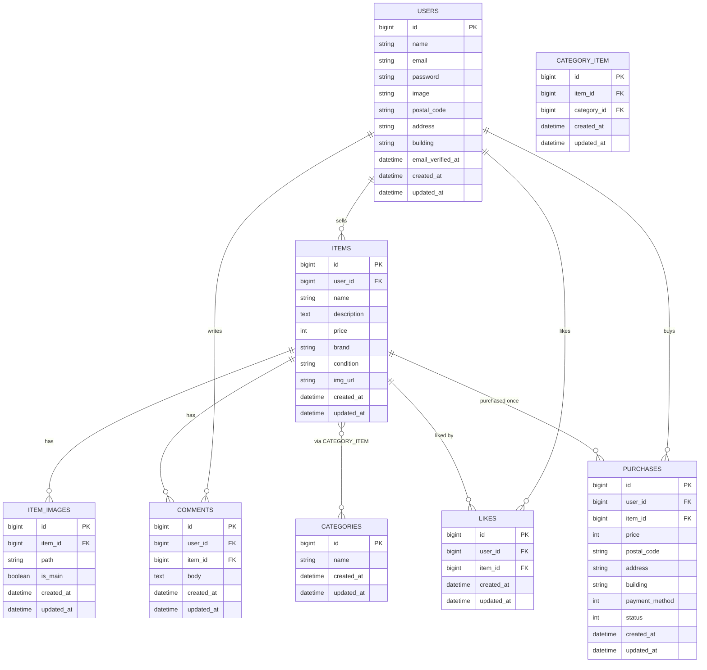

## アプリケーション名

* フリマアプリ **Mogi First**

---

## 環境構築

### 1) リポジトリを取得してディレクトリに入る

```bash
git clone git@github.com:mayu-happy/mogi-first.git
cd mogi-first
```

---

### 2) Docker ビルド & 起動

```bash
docker compose up -d --build
```

---

### 3) Laravel 環境構築（コンテナ内）

```bash
docker compose exec php bash
```

> ⚙️ **補足：src ディレクトリ構成について**  
> このプロジェクトは **`src/`** に Laravel 本体が入っています。  
> 以降の `composer` / `php artisan` コマンドは、**コンテナ内 `/var/www`（= ホストの src/）** で実行してください。  
> `pwd` で `/var/www`、`ls artisan` で `artisan` が見えることを毎回確認すると安全です。

---

### 4) Laravelの準備（依存インストールと `.env` 作成）

```bash
composer install
cp .env.example .env
```

`.env` の DB 設定をこのように変更してください（抜粋）：

```env
DB_CONNECTION=mysql
DB_HOST=mysql
DB_PORT=3306
DB_DATABASE=laravel_db
DB_USERNAME=laravel_user
DB_PASSWORD=laravel_pass
```

---

### 5) アプリキー生成

```bash
php artisan key:generate
```

---

### 6) マイグレーション & 初期データ投入

```bash
php artisan migrate --seed
```

> ※ カテゴリ、サンプル商品、サンプルユーザーが自動で生成されます。

---

## サンプルユーザー

| ユーザー名 | メールアドレス | パスワード |
|-------------|----------------|-------------|
| テスト一郎 | sample1@example.com | password |
| テスト花子 | sample2@example.com | password |

---

### 7) ストレージを公開

```bash
php artisan storage:link
```

---

## PHPUnit テスト実行手順

### 1) コンテナ起動（ホスト側、プロジェクトルート `mogi-first` ディレクトリで）

```bash
docker compose up -d
docker compose ps
```

---

### 2) 依存導入＆アプリキー作成（初回のみ／PHPコンテナ内で実行）

```bash
docker compose exec php bash
composer install
cp -n .env.example .env || true
php artisan key:generate
```

> すでに環境構築済みの場合は、このステップはスキップしてOKです。

---

### 3) テストDB用 `.env.testing` の作成

```bash
cp .env .env.testing
```

`.env.testing` 内の DB 設定をテスト用に変更してください（例）：

```env
DB_CONNECTION=mysql
DB_HOST=mysql
DB_PORT=3306
DB_DATABASE=laravel_test_db
DB_USERNAME=laravel_user
DB_PASSWORD=laravel_pass
```

---

### 4) テスト用マイグレーション（testing 環境）

```bash
php artisan migrate --env=testing --no-interaction
```

---

### 5) テスト実行

```bash
php artisan test
```

または詳細表示付き：

```bash
vendor/bin/phpunit --testdox
```

---

## 🧩 トラブルシュート：テスト用DBへのアクセス権エラー

### 💡 発生するエラー例

```bash
php artisan migrate --env=testing --no-interaction
```

実行時に以下のようなエラーが出ることがあります。

```bash
SQLSTATE[HY000] [1044] Access denied for user 'laravel_user'@'%' to database 'laravel_test_db'
```

---

### 🔍 原因

- MySQL にテスト用データベース `laravel_test_db` がまだ存在しない  
- またはユーザー `laravel_user` に `laravel_test_db` への権限が付与されていない

---

### 🛠 対処手順（Docker + MySQL 環境）

#### 1. MySQLコンテナに入る

```bash
docker compose exec mysql bash
```

#### 2. rootユーザーでMySQLにログイン

```bash
mysql -u root -p
```

> 💡 パスワードは `docker-compose.yml` で指定した  
> `MYSQL_ROOT_PASSWORD`（例：`root`）を入力してください。

#### 3. テスト用DBを作成し、権限を付与

```sql
CREATE DATABASE IF NOT EXISTS laravel_test_db
  CHARACTER SET utf8mb4
  COLLATE utf8mb4_unicode_ci;

GRANT ALL PRIVILEGES ON laravel_test_db.* TO 'laravel_user'@'%';
FLUSH PRIVILEGES;
EXIT;
```

#### 4. PHPコンテナでマイグレーション再実行

```bash
docker compose exec php bash
php artisan migrate --env=testing --no-interaction
```

---

### ⚙️ `.env.testing` の設定確認

```env
DB_CONNECTION=mysql
DB_HOST=mysql
DB_PORT=3306
DB_DATABASE=laravel_test_db
DB_USERNAME=laravel_user
DB_PASSWORD=laravel_pass
```

✅ これで `php artisan migrate --env=testing` が正常に動作し、  
PHPUnit テストを実行できる状態になります！

---

## 開発環境 URL

- ホーム: <http://localhost>
- 会員登録: <http://localhost/register>

---

## フロントで使用している JavaScript

このアプリでは、UIを分かりやすくするために以下の3か所で素の JavaScript（Blade 内スクリプト）を使用しています。  
追加のビルド手順は不要です。

1. **出品フォームの商品画像プレビュー**  
2. **プロフィール画像のプレビュー**  
3. **購入画面の支払い方法による金額表示の更新**

---

## その他補足事項

本アプリの以下の仕様変更については、コーチより事前に許可を得ています。

1. **商品ダミーデータの追加**  
   Seeder で商品数を増やし、一覧・ページネーションの動作確認を容易にしています。

2. **ページネーション機能の実装**  
   商品一覧およびマイページに Laravel の `paginate()` を使用し、可読性と操作性を向上しています。

---

## ER 図


